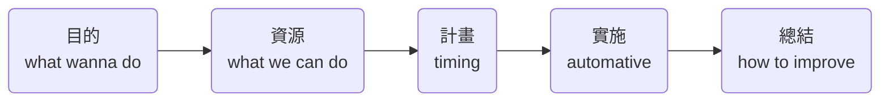

### 【主題】
本次會議主要針對網站與amazon運營之間活動聯動中的溝通問題進行策略層面的討論。
### 【大綱】
1.	**amazon 北美站提出產品結構策略及合作需求。**
    重點合作項目:增長型&潛力型 網站可借鑑項目:成熟型
2.  **計畫頻率與主題調整。**
    amazon給到網站推廣計畫的頻率改為每季度一次;主題限於節令推廣及新品計畫。
3.  **加強雙方了解。**
    明確雙方手頭資源(推廣方式)及分工。
4.  **流程梳理。**
    梳理了一般大型活動的必要步驟。
### 【詳情】
#### ++*活動思路*++

**[目的]:即對活動&產品的分類。**
 - #A類:多站聯動大促,deal為主,**促進銷量**
 - #B類:多站聯動,**推廣曝光**為主,deal為輔
 - #C類:中小節令,日常deal等,不聯動。

**[資源]:對現有資源的分類。**
(未來還需針對時效性、費用等因素詳細梳理。)
(可能涉及deal費用攤分,後續遇到再討論,初步預計以成交比例分擔。)
 - 內部動作\*網站
	IMG Carousel、詳情頁、collection、折扣、BLOG、網站ADs、EDM
 - 內部動作\*amazon
	price/coupon/code、站內LD/7D Deal、AMZ Post、PPC、站外deal/刷單
 - 外部資源\*內容輸出型(耗時較長)
	YouTube、測評、PR軟文等、twi/IG等KOL
 - 外部資源\*其他即時資源
	Deal site、SNS轉發、論壇/社群等

#### ++*活動流程*++
1. amazon運營提前給到每季度大略的產品推廣計畫;
2. 網站推廣整合資源及各站計畫,形成初步排期;
3. **會議一**討論修整排期計畫;
4. 進一步縮小時間範圍至周後,生成項目安排甘特圖;
5. 明確時點,活動實施,預期實施中一次反饋**會議二**,討論重難點、planB;
6. 結束後總結。

#### ++*目前問題及解決方案*++
1. 目的不明確,工作零碎感強:
	進行行銷計劃統籌,活動目的分類。
2. 信息/知識不對等,各部門思維方式不同:
	已互相明確各人權責,後續不定期進行基礎思路溝通/培訓。
3. 溝通效率低,互相不清楚工作內容,導致交流混亂費時:
	結合活動plan及甘特圖,至少每月一次會議討論,明確項目。
